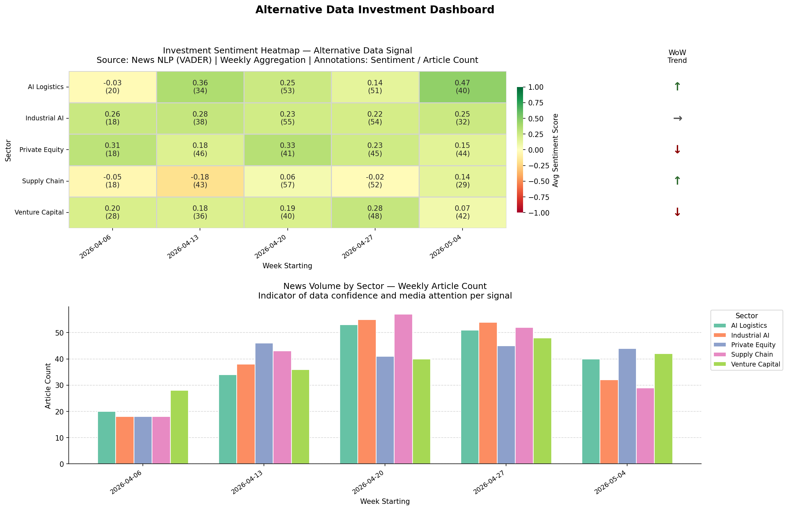

# Investment-Signal-Heatmap

This repo is a python pipeline that pulls live financial news, scores their sentiment using VADER NLP sentiment scoring, across key sectors such as Industrial AI, Supply Chain, Private Equity, AI Logistics, and Venture Capital.

# Example Output 

# Setup

Clone the repo:

git clone https://github.com/MaxwellCGoehle/investment-signal-heatmap
cd investment-signal-heatmap

Install dependencies:

pip install -r requirements.txt

Get a free api key at https://newsapi.org, then place it in an '.env' file at the root structured as NewsAPI = key

Data will be saved in the data folder described by todays date, with visualizations being stored in the visuals folder. 

Examples for both are available in those folders. 